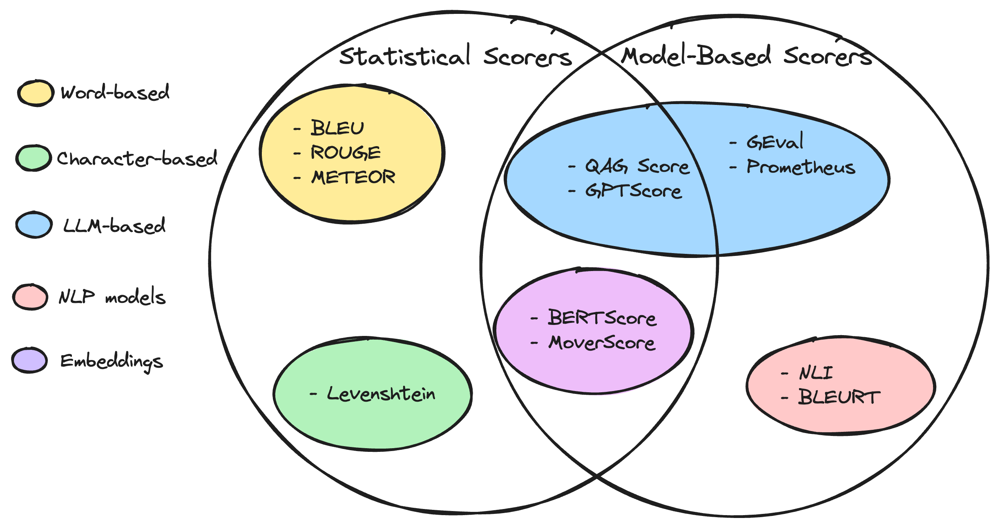

# LLM Evaluation Metrics

Evaluating the outputs of Large Language Models (LLMs) is crucial for delivering reliable LLM applications, yet it remains a challenging task for many. Whether you’re improving model accuracy through fine-tuning or optimizing contextual relevance in a Retrieval-Augmented Generation (RAG) system, establishing and selecting the right evaluation metrics for your specific use case is essential for building a robust LLM evaluation pipeline.

## Table of contents
1. [Introduction to Evaluation Metrics](#introduction)
2. [Types of Metric Scores](#types_of_metric_scores)
    - [Statistical Scorers](#statistical_scorers)
    - [Model-based Scorers](#llm-based-scorers)
3. [RAG metrics](#rag-metrics)
4. [Custom metrics](#summarization-metrics)
5. [Conclusion](#conclusion)

## Introduction to Evaluation Metrics 
LLM evaluation metrics, including answer correctness, semantic similarity, and hallucination, assess an LLM system’s output based on key criteria. These metrics are essential for evaluating LLM performance, providing quantifiable insights into the effectiveness of various systems, whether they include additional components (such as RAG, Summarization, Agents, etc.) or the LLM alone.

Here are the most important metrics to assess your LLM system:

- *Answer Relevancy*: Measures whether an LLM’s response addresses the input accurately and concisely.
- *Faithfullness*: Assesses if an LLM’s response is factually correct against a ground truth.
- *Hallucination*: Identifies if an LLM’s response includes fabricated or inaccurate information.
- *Contextual Relevancy*: Evaluates if the retriever in a Retrieval-Augmented Generation (RAG) system supplies the most relevant context for the LLM.
- *Responsible Metrics*: Includes metrics like bias and toxicity to determine if an LLM’s output is offensive or harmful. CMS Responsible AI (RAI) principles, for example, defines six principle domains for RAI: - **fairness and impartiality**, **transparency and explainability**, **accountability and compliance**, **safety and security**,**privacy**, and **reliability and robustness**
- *Task-Specific Metrics*: Custom metrics tailored to a specific application, like summarization, which adapts to unique criteria based on use case. For instance, if an LLM system is designed for summarizing news articles, its evaluation might need metrics to ensure Whether the summary contains adequate information from the original text? or Whether the summary ss free of contradictions or hallucinations based on the source?

In RAG-based applications, additional metrics to score retrieval context quality may also be necessary. Overall, effective LLM metrics evaluate an LLM based on its intended function (which can be the LLM alone).

The best evaluation metrics are:

- **Quantitative**: Metrics should produce a score, setting a minimum threshold for “good enough” and allowing you to track score improvements over time.
- **Reliable**: Even with the variability of LLM outputs, metrics should be consistently reliable. Although LLM-based evaluators (like G-Eval) are often more accurate than traditional scoring, they can sometimes lack consistency.
- **Accurate**: Scores are valuable only if they truly represent the LLM’s performance. The key to creating an excellent metric is to align it closely with human judgment.

The challenge, then, is designing LLM evaluation metrics that compute both reliable and accurate scores.

## Types of Metric Scorers 

There are different types of scorers that were developed by the NLP community over the years to evaluate LLM outputs. Some are borrowed from a classical NLP world and rely purely on statistical analysis and some are novel and use trasformers and LLM-as-a-judge techniques.

### Statistical Scorers 
Here’s a quick overview of common scoring methods:

- **BLEU (BiLingual Evaluation Understudy)**: This metric assesses LLM outputs against annotated ground truths, calculating precision for matching n-grams (sequences of n consecutive words) between an LLM output and the expected response. It computes a geometric mean of these matches and applies a brevity penalty if necessary.
- **ROUGE (Recall-Oriented Understudy for Gisting Evaluation)**: Primarily used for evaluating summaries, ROUGE calculates recall by measuring the overlap of n-grams between LLM outputs and reference texts. It provides a score (0–1) reflecting the proportion of n-grams in the reference text found within the LLM’s output.
- **METEOR (Metric for Evaluation of Translation with Explicit Ordering)**: This metric combines precision and recall, adjusted for differences in word order, to give a more comprehensive score. METEOR also leverages external databases like WordNet to account for synonyms, and it calculates the harmonic mean of precision and recall, including penalties for word order discrepancies.
- **Levenshtein Distance (Edit Distance)**: This metric calculates the minimum number of single-character edits (insertions, deletions, or substitutions) required to transform one text string into another. It’s especially useful for evaluating tasks like spelling correction, where precise character alignment is essential.

Since these statistical metrics don’t consider semantic meaning and have limited reasoning capabilities, they often fall short in evaluating the long, complex outputs typical of LLMs.

### Model-based Scorers 

Statistical scorers don't take context into account and thus are not entirely accurate. This is where Model-Based scorers come in handy. In a nutshell, pre-trained model is often used to score the output of LLM against a predefined input. When it comes to model-based scorers, there are non-LLM scorers and LLM-as-a-judge techniques. Examples of non-LLM scorers include:

- **NLI** Scorer: This uses Natural Language Inference models, a type of NLP classification model, to evaluate if an LLM output is logically consistent (entailment), contradictory, or neutral concerning a reference text. The score typically ranges from 1 (entailment) to 0 (contradiction), offering a measure of logical coherence.
- **BLEURT (Bilingual Evaluation Understudy with Representations from Transformers)**: This scorer leverages pre-trained models like BERT to assess LLM outputs against expected responses.
- **BERTScore**: The BERTScore metric utilizes pre-trained models like BERT to assess semantic similarity by calculating the cosine similarity between the contextual *embeddings* of words in both the reference and generated text. These word-level similarities are then averaged to yield a final score, with higher BERTScores indicating a stronger semantic match between the LLM output and the reference text.
- **MoveScore**: MoverScore uses embedding models, particularly pre-trained language models like BERT, to generate richly contextualized word embeddings for both the reference and generated texts. It then applies Earth Mover’s Distance (EMD) to determine the minimal transformation cost required to shift the word distribution in the generated text to align with that of the reference text.

However, these methods have several limitations. For instance, NLI scorers can struggle with accuracy on longer texts, and BLEURT’s performance depends heavily on the quality and relevance of its training data. Both the BERTScore and MoverScore scorer are vulnerable to contextual awareness and bias due to their reliance on contextual embeddings from pre-trained models like BERT.

Now, let’s look into LLM-based evaluators as scoring judges:
- **G-Eval**: G-Eval is a framework developed for using LLMs, specifically GPT-4 (but other LLMs show great results as well), to evaluate other LLM outputs, enhancing alignment with human judgment and enabling task-specific scoring. G-Eval generates evaluation steps through a “chain of thoughts” (CoT) process, which then guide the LLM to score outputs based on criteria like coherence on a scale from 1 to 5. For finer precision, the algorithm can normalize scores by factoring in output token probabilities. The G-Eval method has shown strong correlation with human evaluations, outperforming traditional, non-LLM-based metrics by leveraging the semantic understanding capabilities of LLMs. While subjective, G-Eval’s flexible criteria and ability to provide rationale for scores make it a robust choice for nuanced evaluations. Here is a link to the original paper ["NLG Evaluation using GPT-4 with Better Human Alignment"](https://arxiv.org/pdf/2303.16634.pdf).
- **Prometheus**: Prometheus is an open-source LLM designed to evaluate other LLM outputs with capabilities comparable to GPT-4 when provided with reference answers and scoring rubrics, making it adaptable across use cases like G-Eval. Built on the Llama-2-Chat model, Prometheus is fine-tuned on 100,000 pieces of feedback generated by GPT-4. Unlike G-Eval, which uses GPT-3.5/4 with dynamically generated evaluation steps (CoTs), Prometheus relies on predefined rubrics and example evaluation results provided in its prompt, though it tends to give more specific yet sometimes overly critical feedback. Here is a link to the orginal paper ["PROMETHEUS: INDUCING FINE-GRAINED
EVALUATION CAPABILITY IN LANGUAGE MODELS"](https://arxiv.org/pdf/2310.08491.pdf)
- **GPTScore**: GPTScore is an evaluation metric that uses a language model like GPT to assess the quality of text, specifically by having the model act as a “judge” to score or rank outputs based on certain criteria, such as coherence, relevance, or factual accuracy. This method leverages the model’s understanding of language and context to simulate human-like evaluation, typically by prompting the model to assign scores or generate feedback on text generated by other LLMs.The main benefits of GPTScore include its flexibility to adapt to various scoring criteria and its ability to capture nuanced aspects of language that traditional statistical metrics (like BLEU or ROUGE) may miss. Since it’s based on language models, GPTScore can understand more complex semantics, but it may also introduce some inconsistency due to its probabilistic nature, which can result in slight variability in scores across different prompts or contexts.
GPTScore is part of the growing area of LLM-Eval methods, which use LLMs themselves to evaluate outputs from other LLMs, similar to frameworks like G-Eval and Prometheus.
- **QAG (Question Answer Generation) Score**: QAG is an evaluation method that uses LLMs’ reasoning skills to assess LLM outputs by answering yes-or-no questions about extracted claims, rather than having LLMs generate scores directly. For instance, to measure faithfulness (whether content is factual or hallucinated), the process involves: extracting all claims from an LLM output, formulating yes-or-no questions for each claim, and consulting a ground truth source to verify accuracy. The final score, representing the proportion of accurate claims, is computed based on the number of correct (yes) answers. This approach yields reliable and precise scores by leveraging LLM reasoning without relying on direct LLM scoring.

This area is a subject of active research and new methods/papers are published every week. We will be incorporating new methods into our evaluation process as they mature.

## RAG Metrics 
When it comes to measuring RAG systems, [RAGAS paper](https://arxiv.org/pdf/2309.15217) laid the foundation to RAG Triad. RAGAS (Retrieval-Augmented Generation Analysis Suite) is an open-source framework designed to evaluate and improve Retrieval-Augmented Generation (RAG) pipelines by assessing key aspects like faithfulness, relevancy, and recall. It provides a set of evaluation metrics tailored to analyze how well responses generated by RAG models align with the provided context and ground truth. RAGAS uses metrics such as faithfulness (verifying the factual consistency of generated answers), answer relevancy (how closely the response aligns with the query), context relevancy (focus within the retrieved data), and context recall (retrieval of essential context elements needed for accurate responses). These metrics are instrumental in offering developers quantitative feedback to refine and monitor RAG systems for more continuous evaluation and debugging support. Here is our deep dive into 
[RAG Evaluation](RAGEvaluation_with_deepeval.ipynb).

## Custom Metrics 
If your GenAI system requires more than just LLM or RAG evaluation metrics, you will need to develop Custom Metrics. 

For example, **Summarization** metric is used to assess the quality of the produced summary against the original text. Here is our deep dive into [Summarization evaluation](SummarizationEvaluation_with_deepeval.ipynb).

Another aspect is the adherence of the GenAI system to CMS Responsible AI principles. There 6 domains to account for:
- **Fairness and Impartiality**
- **Transparency and Explainability**
- **Accountability and Compliance**
- **Safety and Security**
- **Privacy**
- **Reliability and Robustness**

Most of these principles are subjective and require Human judgement. However, **Fairness and Impartiality** metrics is akin to **Bias** metric and can be computed using the framework. Here is a detailed implemetation for **Fairness and Impartiality** - [RAG Evaluation](RAGEvaluation_with_deepeval.ipynb).

## Conclusion 
The primary goal of evaluating an LLM is to objectively measure its performance, with various scoring methods available, each offering different levels of accuracy. LLM-based scorers, such as G-Eval, Prometheus, and QAG, provide high accuracy due to their advanced reasoning capabilities. However, extra care must be taken to maintain the reliability of these scores. Ultimately, selecting the appropriate metrics should be guided by the specific use case and setup of the LLM, with RAG and fine-tuning metrics serving as strong foundational tools for evaluating outputs.